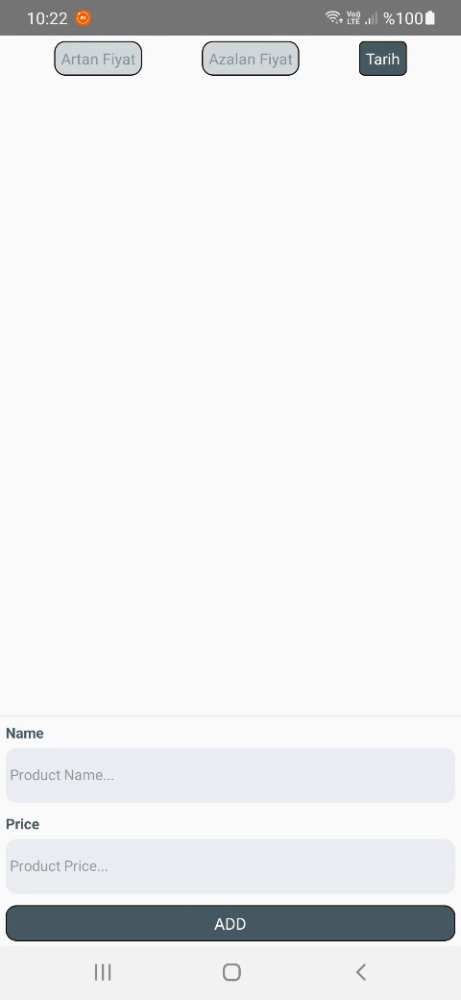

# week_2-OsmanAlperCAM
Inavitas&Basarsoft react-native bootcamp 2nd week homework organized by patika.dev

## Introduction
The purpose of this Assignment is to display the entered data on the screen and to sort the data when the buttons are clicked.

## Screenshot

